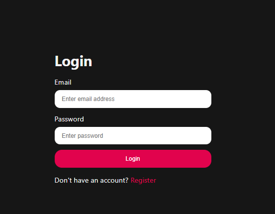
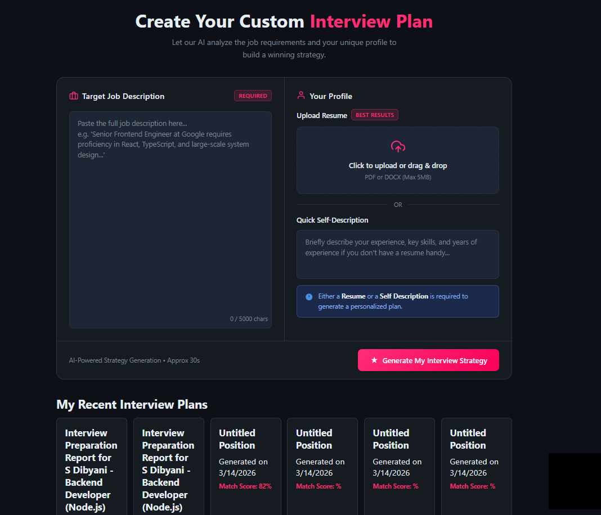
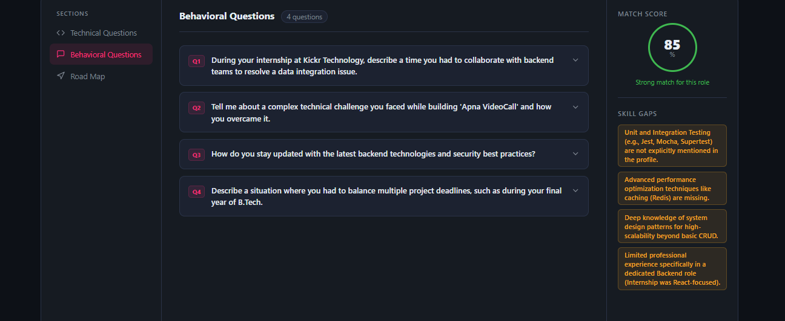
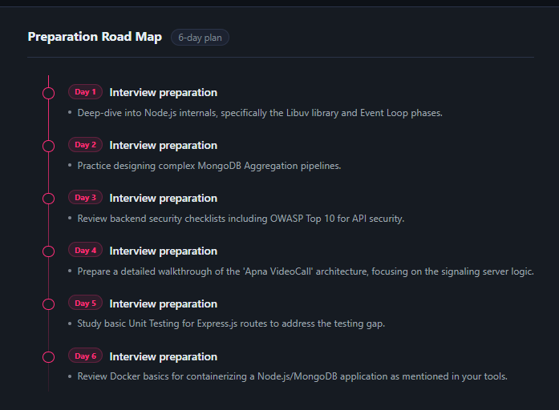
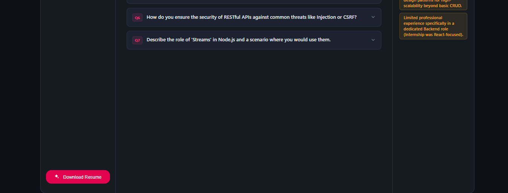

#  Interview Prep Using GenAI

An AI-powered Interview Preparation platform built with the **MERN Stack** and **Google Gemini AI** that helps job seekers analyze their resumes, compare them with job descriptions, identify skill gaps, and prepare for technical interviews.

---

##  Live Demo 
🔗 https://interview-prep-using-gen-ai.vercel.app


---

##  Project Screenshots

###  Login Page



---

###  Dashboard



---

###  Resume Analysis


---

###  Skill Gap Analysis



---

###  AI Interview Questions



---

###  Resume Download



---

#  Features

###  Authentication

- User Registration
- Secure Login
- JWT Authentication
- HTTP Only Cookies
- Protected Routes
- Logout

---

###  Resume Analysis

- Upload Resume
- Paste Resume Content
- Resume Parsing
- AI Resume Review
- Resume Match Score

---

###  Job Description Analysis

- Paste Job Description
- AI Matching
- Resume vs Job Comparison
- ATS Friendly Suggestions

---

###  Skill Gap Analysis

- Missing Skills Detection
- Technical Skills Analysis
- Improvement Suggestions
- Learning Recommendations

---

###  AI Interview Preparation

- Technical Interview Questions
- HR Interview Questions
- Personalized Questions
- AI Generated Answers
- Topic-wise Preparation

---

###  Resume Enhancement

- AI Resume Suggestions
- Resume Optimization
- Updated Resume Download

---

###  User Features

- User Authentication
- Persistent Login
- User Profile
- Secure Sessions

---

#  Tech Stack

## Frontend

- React.js
- Vite
- React Router DOM
- Axios
- CSS
- Context API

---

## Backend

- Node.js
- Express.js
- JWT Authentication
- Cookie Parser
- CORS

---

## Database

- MongoDB Atlas
- Mongoose

---

## AI

- Google Gemini API

---

## Deployment

- Vercel (Frontend)
- Render (Backend)
- MongoDB Atlas

---

## Folder Structure

```
Interview-Prep-Using-GenAI
│
├── frontend
│   ├── public
│   ├── src
│   │   ├── assets
│   │   ├── components
│   │   ├── context
│   │   ├── hooks
│   │   ├── pages
│   │   ├── services
│   │   ├── utils
│   │   ├── App.jsx
│   │   └── main.jsx
│   │
│   ├── package.json
│   └── vite.config.js
│
├── backend
│   ├── controllers
│   ├── middleware
│   ├── models
│   ├── routes
│   ├── services
│   ├── config
│   ├── app.js
│   ├── server.js
│   └── package.json
│
├── screenshots
│   ├── login.png
│   ├── dashboard.png
│   ├── resume-analysis.png
│   ├── skill-gap.png
│   ├── interview-questions.png
│   └── resume-download.png
│
└── README.md
```

---

# Installation

## Clone Repository

```bash
git clone https://github.com/yourusername/interview-prep-using-genai.git
```

```
cd interview-prep-using-genai
```

---

## Install Frontend

```bash
cd frontend
npm install
```

---

## Install Backend

```bash
cd backend
npm install
```

---

# Environment Variables

### Backend (.env)

```env
PORT=5000

MONGO_URI=YOUR_MONGODB_URI

JWT_SECRET=YOUR_SECRET

GOOGLE_GENAI_API_KEY=YOUR_GEMINI_API_KEY

CLIENT_URL=http://localhost:5173
```

---

### Frontend (.env)

```env
VITE_API_URL=http://localhost:5000
```

---

# Run Locally

### Backend

```bash
npm run dev
```

---

### Frontend

```bash
npm run dev
```

---

# API Endpoints

## Authentication

```
POST   /api/auth/register

POST   /api/auth/login

GET    /api/auth/get-me

GET    /api/auth/logout
```

---

## Interview

```
POST   /api/interview/analyze

POST   /api/interview/generate

GET    /api/interview/history
```

---

# Security Features

- JWT Authentication
- HTTP Only Cookies
- Protected Routes
- Secure Password Storage
- CORS Protection
- Environment Variables
- Input Validation

---

# Deployment

### Frontend

- Vercel

### Backend

- Render

### Database

- MongoDB Atlas

---

# Future Improvements

- Resume PDF Upload
- Mock Video Interview
- Voice-based Interview
- Interview Performance Analytics
- Multiple Resume Management
- ATS Resume Checker
- Company Specific Interview Questions
- Dark Mode
- Admin Dashboard

---


⭐ If you found this project useful, don't forget to star the repository.
